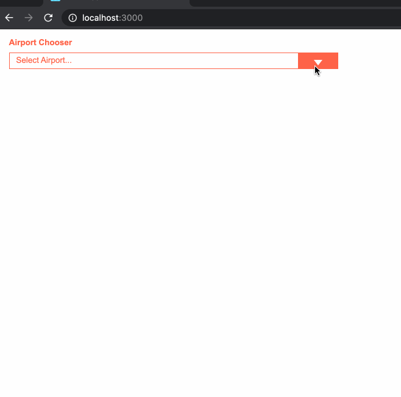

## Quick Demo

## 1. Describe React props and state - how do they work, how are they different, when should we use each one
    Ans: "props" are used to hydrate a component with data. 
    As an example if we say `<SelectBox items = {airportList} />`, we can receive `props.items` inside 
    SelectBox component.
    "state" is current phase of a component. `this.setState({date: new Date()});` 
    is setting date in some component. "state" is component specific. 

## 2. What will cause the render() function of a React component to be executed
    Ans: A change in 'state' or 'props' triggers a render method call. 
    In the above example, we did a `setState`, which will re-render the component.

## 3. Will React or raw JS/HTML deliver better performance for a single page web application, and why
    Ans: Well, this depends on the application. 
    If the single page application is very simple and lightweight, raw JS/HTML would be preferable. 
    However, if the application is having a lot of sections(components) which needs to be changed/updated as per user input, React can help. 
    React helps us to create components, which can be reused. 
    Also, as discussed above, the re-rendering on change of state or props are taken care of already by react. 
    Hence, for a liitle complex application, React can be a great choice.

## 4. Describe the Observer pattern (in the context of UI development), what benefit it provides, how it is used, and a method of implementing in JS
    Observer Pattern: This behavioral design pattern is meant for listening to a stream of data. 
    Observer can listen to one or a collection of data. 
    But, there has to be a Subscriber to get the data and put that in use.
    In my simple words, it can happen in these steps:
    Step 1: Create Stream(from just a simple array maybe, or API response)
    Step 2: Combine the stream and massage the data.
    Step 3: Subscribe to the stream and do some UI stuff.

    Use: lets say, We are trying to get that given Airport list and trying to combine that with user data

        import { ajax } from 'rxjs/ajax';
        import { forkJoin } from 'rxjs';
        import airportList from './data.json';

        forkJoin(
        {
            airportList,
            users: ajax.getJSON('https://api.github.com/users')
        }
        )
        .subscribe(console.log);
        // This should print the object having all the airports and user details

## 5. Explain an approach for adding zoom and pan interaction to the display of a large floorplan image in a web application
    Lets say we have a background image on a div which we want to zoom or pan through. 
    Now, to zoom in or out, basically we want to change the size of it.
    Also, if we are thinking of a viewport, we have to clip out a section of it. 
    Here is a small demo in my codepen: https://codepen.io/mayukhroy/pen/BaKBQyN

    I was looking at an example in w3schools which implements a magnifier here: https://www.w3schools.com/howto/tryit.asp?filename=tryhow_js_image_magnifier_glass

## Available Scripts

In the project directory, you can run:

### `npm start`

Runs the app in the development mode. 
Open [http://localhost:3000](http://localhost:3000) to view it in the browser.

The page will reload if you make edits. 
You will also see any lint errors in the console.

